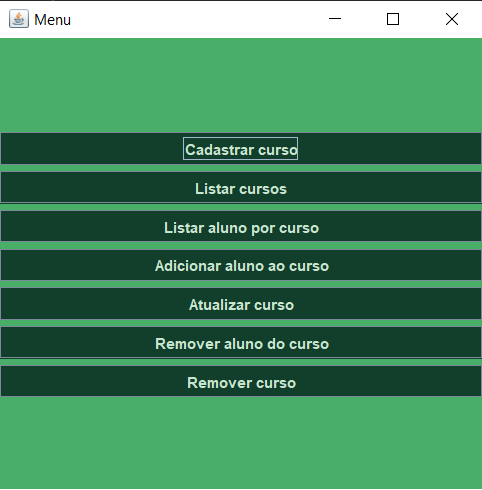
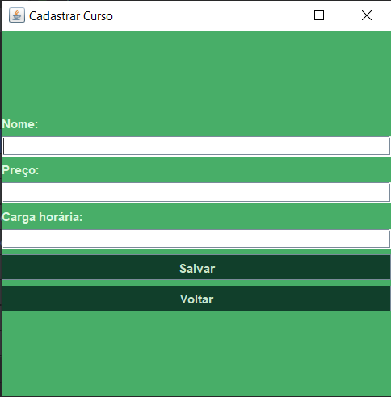
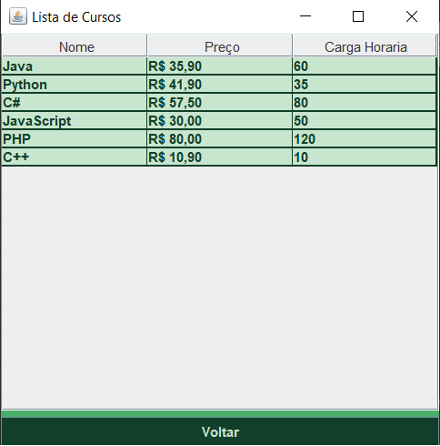
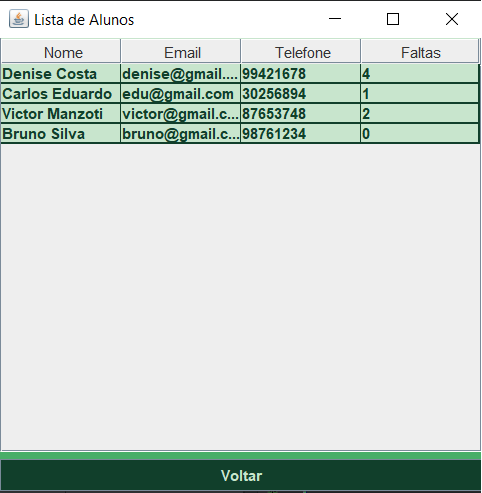
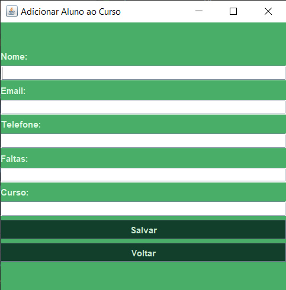
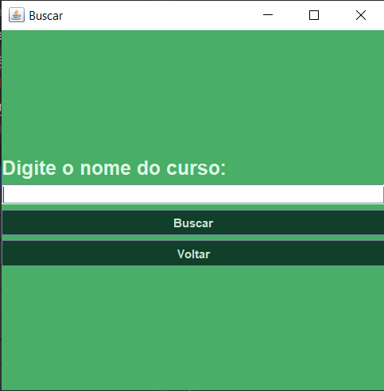
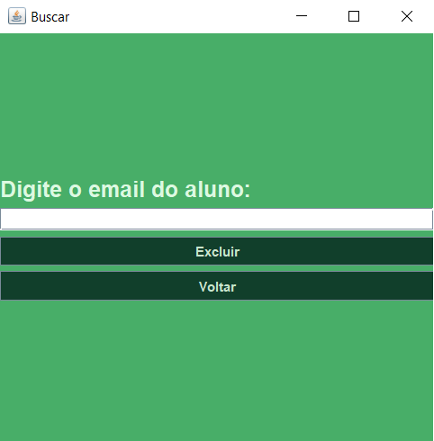
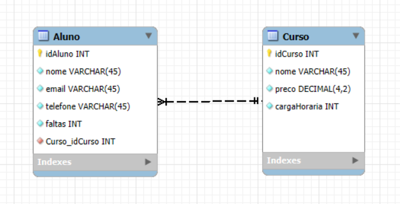

## Gerenciamento de Cursos

Este exercício foi realizado com a supervisão e orientação do meu professor @BiaginiMatheus, utilizando a linguagem Java e apresentando integração com banco de dados através do MySQL.

Neste trabalho foram criadas telas para o gerenciamento de cursos e seus alunos, apresentando um CRUD (_Create, Read, Update, Delete_ - Criar, Ler, Atualizar, Excluir) completo e conexão com um banco de dados no MySQL, estando descritos detalhadamente a seguir.  

## 1- MENU  
Esta é a primeira tela que o usuário tem contato, nela existem botões que descrevem as funcionalidades presentes no programa. Ao clicar em qualquer botão o usuário é redirecionado para a tela correspondente.  

   

## 2- CADASTRAR UM CURSO
Ao selecionar o botão "Cadastrar Curso" o usuário é redirecionado para a tela de cadastro de cursos, nela ele deve preencher os dados de nome, preço e carga horária para cadastrar corretamente o curso desejado. Todos os campos a serem preenchidos apresentam suas respectivas validações, enviando avisos ao usuário caso algo esteja incorreto. Após finalizar o preenchimento dos dados, deve-se clicar em "Salvar" para que o curso cadastrado seja salvo no banco de dados e o usuário receberá uma mensagem de confirmação. Caso não queira cadastrar um curso, basta clicar no botão "Voltar", que faz o redirecionamento para o menu.

   

## 3- LISTAR CURSOS
Ao escolher esta opção, o usuário é redirecionado para uma tela que apresenta uma tabela de cursos mostrando todos os dados salvos no banco de dados de cursos que foram previamente salvos e que ainda estão ativos. 

   

## 4- LISTAR ALUNO POR CURSO
Nesta opção o usuário pode ver todos os alunos que estão cadastrados em um curso específico. Para isso, o programa apresenta uma tela de busca onde o nome do curso deve ser preenchido, caso encontrado, o usuário é redirecionado novamente, mas desta vez para a tela que lista os alunos, semelhante a tela anterior, esta também apresenta uma tabela com os dados correspondentes ao banco de dados.

   

## 5- ADICIONAR ALUNO AO CURSO
Aqui é onde o usuário pode cadastrar alunos para seu curso ou para um curso já existente. Nesta tela são preenchidos os dados de nome, email, telefone, faltas e o curso que o aluno está inscrito. Todos os campos a serem preenchidos apresentam as devidas validações e, caso todos estejam corretos, deve-se clicar no botão "Salvar" e o usuário receberá um comunicado de que o cadastro foi um sucesso. Para desistir da ação, basta utilizar o botão "Voltar".

   

## 6- ATUALIZAR CURSO
Caso alguma informação referente ao curso precise de atualização, deve-se utilizar o botão de atualizar curso. Nele o usuário é apresentado a uma tela de busca onde deve preencher o nome do curso que deseja atualizar, caso encontrado, é redirecionado para a mesma tela de cadastro de curso, com a diferença de que os campos estão preenchidos com os dados anteriores para serem alterados nesta atualização. Para salvar as alterações basta clicar em "Atualizar" ou para voltar ao menu sem salvar, basta utilizar o botão "Voltar".

   

## 7- REMOVER ALUNO DO CURSO
Caso o usuário deseje remover algum aluno específico de um curso, basta selecionar esta opção no menu, após isso ele terá uma tela de busca onde deve preencher o email do aluno, caso encontrado, recebe um alerta de confirmação e se a resposta for positiva, o aluno é permanentemente deletado. Caso deseje apenas voltar ao menu, basta utilizar o botão "Voltar".

   

## 8- REMOVER CURSO
Por último, mas não menos importante, existe a opção de excluir um curso completo com seus alunos. Nesta opção o usuário é redirecionado também para uma tela de busca igual a da opção "Atualizar Curso", onde deve preencher o nome do curso que deseja excluir, caso encontrado, recebe um alerta de confirmação e se a resposta for positiva, o curso é permanentemente deletado.   

Para a utilização do banco de dados neste trabalho, criamos um DER (Diagrama de Entidade e Relacionamento) no MySQL para a criação das tabelas que comportam os dados inseridos no programa. Utilizamos um [script](./SQLCurso.sql) para adição dos cursos e alunos iniciais e para testes de funcionalidades. 

